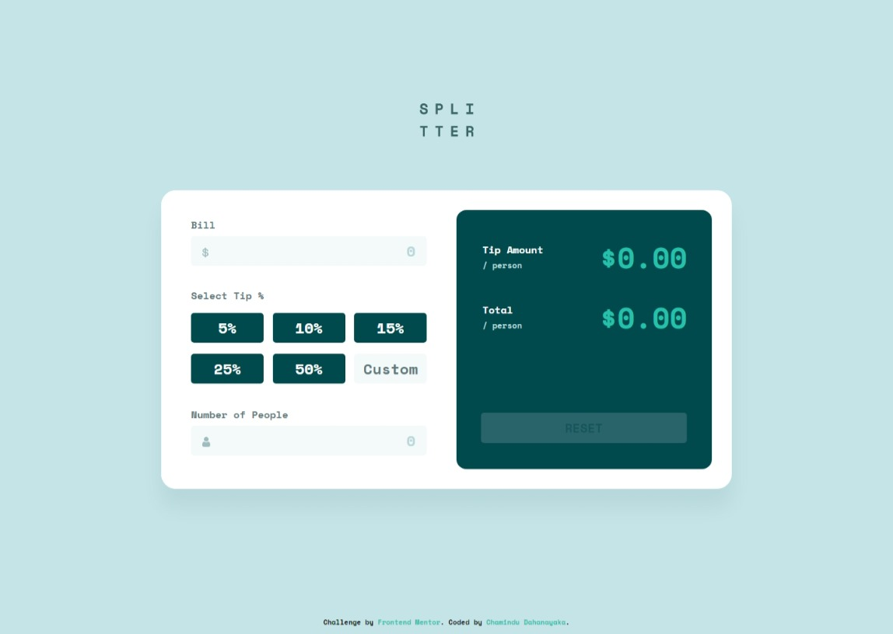

# Frontend Mentor - Tip calculator app solution

This is a solution to the [Tip calculator app challenge on Frontend Mentor](https://www.frontendmentor.io/challenges/tip-calculator-app-ugJNGbJUX). Frontend Mentor challenges help you improve your coding skills by building realistic projects.

## Table of contents

- [Overview](#overview)
  - [The challenge](#the-challenge)
  - [Screenshot](#screenshot)
  - [Links](#links)
- [My process](#my-process)
  - [Built with](#built-with)
  - [What I learned](#what-i-learned)
  - [Continued development](#continued-development)
- [Author](#author)

## Overview

### The challenge

Users should be able to:

- View the optimal layout for the app depending on their device's screen size
- See hover states for all interactive elements on the page
- Calculate the correct tip and total cost of the bill per person

### Screenshot



### Links

- Solution URL: [Solution URL here]()
- Live Site URL: [Live site URL here]()

## My process

### Built with

- Semantic HTML5 markup
- Flexbox
- CSS Grid
- Mobile-first workflow

### What I learned

In this project, I learned to use below code snippets:

```html
<input type="number" name="percent" id="custom-input" placeholder="Custom" min="1" max="99" maxlength="2">
```
```css
.section1 #bill:focus{
  outline: 2px solid hsl(172, 67%, 45%);
}

div{
  display: flex;
  flex-wrap: wrap;
  justify-content: space-between;
}

#reset-btn:disabled{
  color: hsla(183, 100%, 15%, 0.537);
  background-color: hsl(186, 44%, 29%);
  cursor: auto;
}
#reset-btn:not(:disabled):hover{
  color: hsl(183, 100%, 15%);
  background-color: hsl(173, 66%, 78%);
}

input[type=number]::-webkit-inner-spin-button,
input[type=number]::-webkit-outer-spin-button {
    -webkit-appearance: none;
    margin: 0;
}
input[type=number] {
    -moz-appearance: textfield; /* Firefox */
}
```
```js
const bill = parseFloat(billAmount.value);
const noPeople = parseInt(numberOfPeople.value);
const customNumber = parseInt(customNumberInput.value);

form.addEventListener('input', function() {
  const isFormEmpty = Array.from(form.elements).some(element => element.value !== '');
  resetBtn.disabled = !isFormEmpty;
});

if(fivePercent.checked){
  tipAmount = ((bill * 5)/100)/noPeople;
  tip.innerHTML = "$" + Math.floor(tipAmount * 100) / 100;
  totalAmount = (bill / noPeople)+ tipAmount;
  total.innerHTML = "$" + totalAmount.toFixed(2);
}
```

### Continued development

I'm looking to improve my CSS & JavaScript knowledge to design more unique and new stuff.

## Author

- Frontend Mentor - [@ChaminduD](https://www.frontendmentor.io/profile/ChaminduD)
- LinkedIn - [Chamindu Dahanayaka](https://www.linkedin.com/in/chamindudahanayaka/)